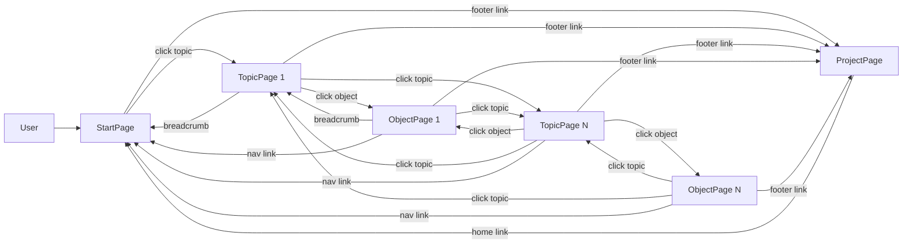
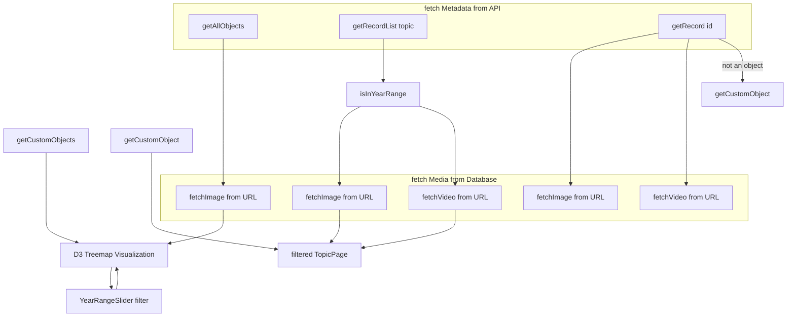

# Audiovisuelles Kulturerbe der Städte in Bewegung 1977-1994

A public web application built with **[Next.js](https://nextjs.org)** (App Router, v15.3.1), deployed on **[Vercel](https://vercel.com/)**. The source code is openly available in this repository.

### The Webapp is available here: [https://stadt-in-bewegung.vercel.app/](https://stadt-in-bewegung.vercel.app/)

## Technical Stack

- **Framework:** [Next.js](https://nextjs.org) (React-based)
- **Deployment:** [Vercel](https://vercel.com/)
- **Language:** JavaScript (no TypeScript)
- **Styling:** Vanilla CSS (no Tailwind)
- **Font Optimization:** [`next/font`](https://nextjs.org/docs/app/building-your-application/optimizing/fonts) with [Geist](https://vercel.com/font)
- **Code Quality:** [ESLint](https://eslint.org/) for static analysis
- **Package Manager:** [npm](https://www.npmjs.com/)

## Project Structure

- Uses Next.js App Router (`/app` directory)
- Modular organization of components, pages, and API routes
- Metadata is fetched from the public API of [Memobase](https://memobase.ch/de/recordSet/soz-016)

## Getting Started

Prerequesites: 
- Node.js 18.18 or higher
- npm

To run the project locally install dependencies and start local developement server:

```bash
npm install
npm run dev
```

## Deployment

The application is automatically deployed via Vercel's GitHub integration.

## Security & Privacy
- No sensitive data (API keys, passwords, or tokens) is stored in the repository
- Build artifacts (.next/ directory) are excluded via .gitignore


## Resources

- [Next.js Documentation](https://nextjs.org/docs)
- [Vercel Documentation](https://vercel.com/docs)
- [Memobase API](https://memobase.ch/de/recordSet/soz-016)
- [Database Bild + Ton](https://www.bild-video-ton.ch/bestand/signatur/F_Videos)
- Buit with the help of ChatGPT 4o, DeepSeek V3 and R, and GitHub Copilot (Model ChatGPT 4.1)
- All metadata is sourced from Memobase. Media assets (stills/videos) are provided by the Bild + Ton database
of Schweizerisches Sozialarchiv.

## Pages and Navigation



*(Outgoing links are left out in this chart.)*

## Data Flow and Functionality



*This simplified graph shows the basic data flow and functions.*

---
© Moira Walter, 2025, Digital Humanities Universität Basel