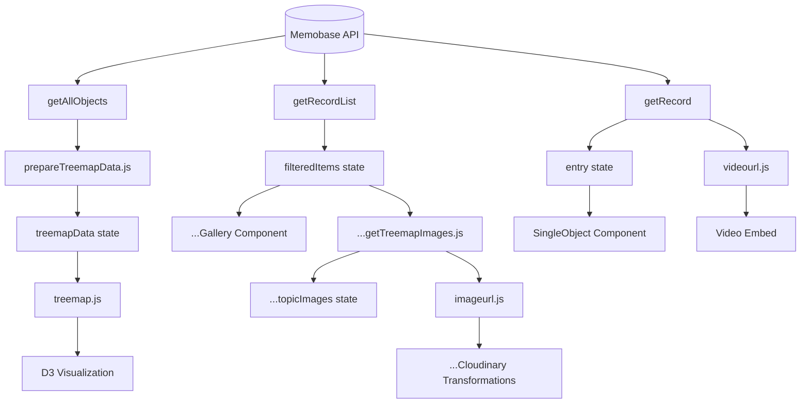

# Stadt in Bewegung

A public web application built with **[Next.js](https://nextjs.org)** (App Router, v15.3.1), deployed on **[Vercel](https://vercel.com/)**. The source code is openly available in this repository.

### The Webapp is available here: [https://stadt-in-bewegung.vercel.app/](https://stadt-in-bewegung.vercel.app/)

## Technical Stack

- **Framework:** [Next.js](https://nextjs.org) (React-based)
- **Deployment:** [Vercel](https://vercel.com/)
- **Language:** JavaScript (no TypeScript)
- **Styling:** Vanilla CSS (no Tailwind)
- **Font Optimization:** [`next/font`](https://nextjs.org/docs/app/building-your-application/optimizing/fonts) with [Geist](https://vercel.com/font)
- **Code Quality:** [ESLint](https://eslint.org/) for static analysis
- **Package Manager:** [npm](https://www.npmjs.com/)

## Project Structure

- Uses Next.js App Router (`/app` directory)
- Modular organization of components, pages, and API routes
- Metadata is fetched from the public API of [Memobase](https://memobase.ch/de/recordSet/soz-016)

## Getting Started

Prerequesites: 
- Node.js 18.18 or higher
- npm

To run the project locally install dependencies and start local developement server:

```bash
npm install
npm run dev
```

## Deployment

The application is automatically deployed via Vercel's GitHub integration.

## Security & Privacy
- No sensitive data (API keys, passwords, or tokens) is stored in the repository
- No personal data or credentials are included in the codebase
- Build artifacts (.next/ directory) are excluded via .gitignore

## Resources

- [Next.js Documentation](https://nextjs.org/docs)
- [Vercel Documentation](https://vercel.com/docs)
- [Memobase API](https://memobase.ch/de/recordSet/soz-016)
- [Database Bild + Ton](https://www.bild-video-ton.ch/bestand/signatur/F_Videos)
- With the help of ChatGPT, DeepSeek and GitHub Copilot (Model ChatGPT)

## Pages and Navigation

## Data Flow and Functionality

---

© Moira Walter, 2025, Digital Humanities Universität Basel

All metadata is sourced from Memobase. Media assets (stills/videos) are provided by the Bild + Ton database
of Schweizerisches Sozialarchiv.

```mermaid
flowchart TD
    A[User] --> B[StartPage]
    B --> C[useEffect: loadData]
    C --> D[getAllObjects API]
    D --> E[API Request to Memobase]
    E --> F[objects array]
    F --> G[prepareTreemapData]
    G --> H[initialData]
    H --> I[setInitialData/setMaxTotalValue]
    
    B --> J[YearRangeSlider]
    J --> K[User changes year range]
    K --> L[setYearRange]
    
    L --> M[useEffect: filter by year]
    M --> N[prepareTreemapData]
    N --> O[setTreemapData]
    
    O --> P[useEffect: render treemap]
    P --> Q[createTreemap D3.js]
    Q --> R[SVG Output]
    
    L --> S[debounced useEffect]
    S --> T[getTreemapImages]
    T --> U[fetchImage]
    U --> V[setTopicImages]
    
    R --> W[User clicks topic]
    W --> X[router.push to themen/topic]
  ```

```mermaid
  flowchart LR
    A[User] --> B[StartPage]
    B -->|click topic| C[TopicPage 1]
    B -->|footer link| D[ProjectPage]
    C -->|click object| F[ObjectPage 1]
    C -->|click topic| E[TopicPage N]
    C -->|breadcrumb| B
    C -->|footer link| D
    D -->|home link| B
    E -->|click object| G[ObjectPage N]
    E -->|click object| F
    E -->|click topic| C
    E -->|footer link| D
    E -->|nav link| B
    F -->|breadcrumb| C
    F -->|click topic| E
    F -->|nav link| B
    F -->|footer link| D
    G -->|click topic| E
    G -->|click topic| C
    G -->|footer link| D
    G -->|nav link| B
```


The outgoing links are left out in this chart.

